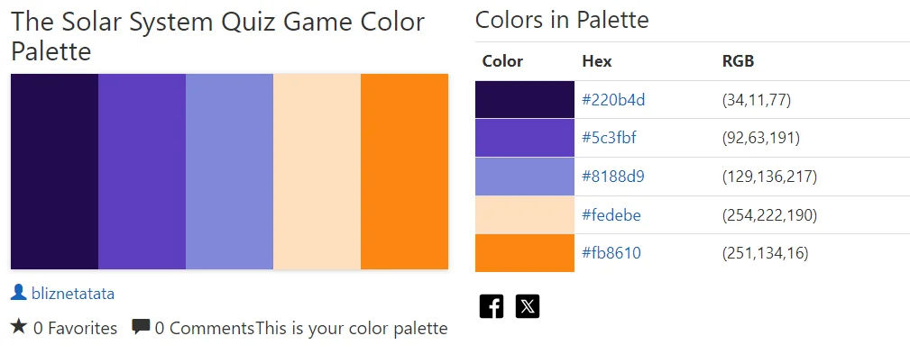

# The Solar System Quiz Game

#### **By Silviya Hristova**

[Click here to view the live web application](https://silviyahristova.github.io/solar-system-quiz/)

This is the documentation for The Solar System Quiz Game’s website. It has been built using HTML5, CSS3 and JavaScript for educational purposes as part of Code Institute’s Level 5 Diploma in Web Application Development.

---

## Table of content

- [**About**](#about)
- [**User Experiences**](#user-experiences)
  - [**User Stories**](#user-stories)
  - [**Strategy**](#strategy)
  - [**Scope**](#scope)
  - [**Structure**](#structure)
  - [**Skeleton**](#skeleton)
  - [**Surface**](#surface)
- [**Technologies Used**](#technologies-used)
  - [**Languages**](#languages)
  - [**Tools**](#tools)
- [**Features**](#features)
- [**Future features**](#future-features)
- [**Testing**](#testing)
- [**Deployment**](#deployment)
- [**Credits**](#credits)
- [**Acknowledgements**](#acknowledgements)

## About

The Solar System Quiz is a question and answer game in which knowledge or estimation questions are to be answered as correctly as possible. This is a responsive website and the topic of the questions is regarding the solar system. The site will target adults and children in a fun and educational way to show their knowledge or learn something new about our solar system.

Click [**here**](https://silviyahristova.github.io/solar-system-quiz/) to view the live website.

## User Experiences

### **User Stories**

- As a first-time visitor, I want to easily understand the main purpose of the site.
- As a first-time visitor, I want to take part in a fun, online, educational game.
- As a first-time visitor, I want to easily access the game.
- As a first-time visitor, I want to find out how to play the game.
- As a first-time visitor, I want to know how many questions left to answer.
- As a first-time visitor, I want to know the scores, during the game.
- As a first-time visitor, I want to be able to restart the quiz anytime.
- As a first-time visitor, I want to see the result at the end of the quiz.
- As a first-time visitor, I want to be able to give my feedback.
- As a first-time visitor, I want to access the quiz on any device.
- As a first-time visitor, I want to be able to see and click on the links to their social media pages.
- As a first-time visitor, I want to navigate the site easily.

### **Strategy**

This project is to design and create a user-friendly and interactive website that is done mainly through HTML, CSS and JavaScript.

The main goal of the website is to allow users to test their knowledge, learn new facts, and have fun with trivia questions. The quiz game help with concentration, identify gaps in knowledge, build confidence and help children retain information in a fun way. Our quiz game prevent the mind from wandering, ensuring information absorbation. It is also learning enjoyable. Incorrectly answered questions immediately highlight knowledge gaps.

By making the site fully responsive, the site aims to be easily accessible no matter which platform the user is viewing the site on.

### **Scope**

The main features that will be implemented into the website will be included on two separate pages. The design of the website should look fun, educational and interesting at the same time simple and eye-catching. In help to create this design will be carefully selected color palette and fonts.

The site will have challenging questions before the start of the quiz. This will help users think, that they are participating in an adventure quiz, so they can be motivated to answer the questions correctly to prove themselves that they are worthy of the challenge. The website will have how to play section, which will include the rules of the quiz. It will have also contact details and social media links, making it easy for users to get in touch.

### **Structure**

The structure of the website is to have two separate pages - game page and contact page. It is designed to be mobile-first design. Every page will have a header,logo and footer. There will be an additional 404.html page.

### **Skeleton**

To create the wireframes, the design tool Figma is used. There were fifteen frames created- for the main function on the two pages and for three devices- desktop, tablet, and mobile. They were created to help establish a clear and organized structure for the website. They provide an outline of the layout how elements will be arranged on the screen, and how the interface will adopt the different screen sizes and devices, laying the foundation for responsive design.

Desktop

Tablet

Mobile

### **Surface**

**Colour**

The color palette is selected based on the unique meaning of each colors and their combination together. Purple and violet colors promote harmony of the mind and the emotions, contributing to mental balance and stability, peace of mind, a link between the spiritual and the physical worlds, between thought and ativity.The color orange radiates warmth and happiness, combining the physical energy and stimulation of red with the cheerfulness of yellow. The color psychology of orange is optimistic and uplifting, rejuvenating our spirit. Peach encourages great communication and conversation. It inspires good manners and puts people at ease. It has all the attributes of orange but in a much softer, gentler and more cautious form. This version of orange encourages vitality and self-control. Using apricot can evoke feelings of warmth and friendliness. This color communicates a sense of comfort and approachability, making it ideal for creating inviting and cheerful spaces.
The choice of colours will align with the colours of the images, used in the project. The palette were created using the site [Color-hex.com](https://www.color-hex.com/). Tints and Shades of these colours will be used also and are created using the site [Maketintsandshade.com](https://maketintsandshades.com/).

Tints and shades

**Typography**

The fonts that will be used in the website will be imported from [Google Fonts](https://fonts.google.com/) and will be used [Engagement](https://fonts.google.com/specimen/Engagement) and [Lora](https://fonts.google.com/specimen/Lora). Semi-formal with a steady hand and soft contours, Engagement is a brush script that dances a line between vintage and modern flair. This classic calligraphic script font is perfect for amazing postcard designs, wedding invitation designs, image headings, and titling purposes. Lora is a well-balanced contemporary serif with roots in calligraphy. It is a text typeface with moderate contrast well suited for body text. A paragraph set in Lora will make a memorable appearance because of its brushed curves in contrast with driving serifs.

**Logo**

The logo is created using [Canva](https://www.canva.com/design/DAGVX0sxbDk/QxmT7W9rV6dBT0eca0dxVw/edit) logo design tool. The colors are chosen from the color palette for the website. This will help users connect the logo with the colors of the company and website. Th symbol is related to the purpose of the website.

Logo image

**Images**

The images on the pages were chosen to be relevant to the content of the page. The video has been selected to be educational to keep users more interested about our solar system and It is meant to be a prize at the end of the quiz.

**Icons**

The icons that will be used are from [Font Awesome](https://fontawesome.com/) website. Having icons as the social media links immediately allows the user to easily identify which social media platform is which. Icons for the website are carefully chosen to be semantic relevance to represent concepts. They help users quickly understand and navigate throughout the website. The icons on the footer are all easily appealing on the eye for the user.

**Sound**

The sounds in the quiz are from [FreeSound](https://freesound.org/) website. They are used to enhance engagement and interactivity. Sound effects provide immediate feedback for correct and incorrect answers, making the experience more dynamic and enjoyable. Additionally, audio helps to guide users through the quiz and improve memory by reinforcing actions with auditory feedback. To ensure accessibility and user comfort, there is an options to mute or not the sound, ensuring the quiz is inclusive and customizable for everyone. A 15-second timer sound is included to add a sense of urgency and challenge to the quiz. It encourages quick thinking and decision-making, which makes the experience more engaging and dynamic. The timer also helps prevent overthinking or relying on external resources, ensuring that the answers are based on the participant's immediate knowledge.

[Back to top](#table-of-content)

## Technologies Used

### Languages

- [HTML](https://en.wikipedia.org/wiki/HTML5)
- [CSS](https://en.wikipedia.org/wiki/Cascading_Style_Sheets)
- [JavaScript](https://en.wikipedia.org/wiki/JavaScript)

### Tools

+ [Bootstrap 5.2](https://getbootstrap.com/)
    + used to create the structure and layout of the website, making it responsive on all devices.
+ [Google Fonts](https://fonts.google.com/)
    + used to get the links to the fonts that are in the head of the html pages. These fonts are then used throughout the website.
+ [Font Awesome](https://fontawesome.com/)
    + used to add icons to the project.
+ [GitHub](https://github.com/)
    + used as a repository and to host the full project.
+ [GitPod](https://www.gitpod.io/)
    + used IDE to develop the website.
+ [Figma](https://www.figma.com/)
    + used to create the wireframes and design layout for the project.
+ [Canva](https://www.canva.com/)
    + used to create the logo image for the project.
+ [Pexels](https://www.pexels.com/)
    + used to source images and video that would be used within the website.
+ [Freepik](https://www.freepik.com/)
    + used to source images that would be used within the website.
+ [Pixelied](https://pixelied.com/convert/)
    + used to convert PNG and JPG images to WEBP format images.
+ [Favicon](https://favicon.io/)
    + used to create the favicon for the website.
+ [Color-hex](https://www.color-hex.com/)
    + was used to create the colour palette that was used through the website.
+ [Make Tints and Shades](https://maketintsandshades.com/)
    + used to create the tints and shades from the main colour palette for use on the whole site.
+ [Grammarly](https://app.grammarly.com/)
    + used to check spelling, grammar, and punctuation in the content of the website.
+ [Responsive Image Linter](https://chromewebstore.google.com/detail/responsive-image-linter/mnddginionlghpblkimpdalcecpnbjln?pli=1)
    + used to test responsive images and provide suggestions for the sizes attribute.
+ [WebAIM](https://webaim.org/resources/contrastchecker/)
    + used to check the color contrast.
+ [WAVE Web Accessibility](https://wave.webaim.org/)
    + used to make web content more accessible to individuals with disabilities.
+ [Mock-up Image](https://amiresponsive.blogspot.com/)
    + used to create the responsive mock-up image that is at the beginning of the readme file.
+ [Google Dev Tools](https://developer.chrome.com/docs/devtools)
    + used to test features, responsiveness and to troubleshoot.
+ [Chrome Capture - screenshot & gif tool](https://chromewebstore.google.com/detail/chrome-capture-screenshot/ggaabchcecdbomdcnbahdfddfikjmphe?hl=en-US&utm_source=ext_sidebar)
    + used to take screenshots and screen record to use in the Readme file.
+ [GIF Compressor](https://www.freeconvert.com/gif-compressor)
    + used to compress gif files to use in the Readme file.
+ [FreeConvert](https://www.freeconvert.com/wav-to-mp3/download)
    + used to convert WAV sound files to MP3 files.
+ [FreeSound](https://freesound.org/)
    + used to download the sound files.
+ [Email JS](https://www.emailjs.com/)
    + used to send email directly from the code.
+ [Youtube API](https://developers.google.com/youtube)
    + used to add YouTube functionality in the website.
+ [Node JS](https://nodejs.org/en)
    + runtime environment that allows to run JavaScript on the server side.

[Back to top](#table-of-content)

## Features

## Future features

* To add levels of difficulty - easy, medium, hard.

* To add leaderboard to display top scores and rankings for users to encourage competition.

* To add dynamic feedback showing detailed explanations for correct and incorrect answers.

* To add option to allow users skip questions and return to them later.

* To add options to create accounts to save progress and scores.

## Testing

Please refer to [**here**](TESTING.md) for more information on testing HandyFix.

[Back to top](#table-of-content)

## Deployment

### GitHub Pages

The site was deployed to GitHub pages. The steps to deploy are as follows: 
1. In the GitHub repository, navigate to the Settings tab 
2. From the left hand menu select 'Pages'
3. From the source select Branch: main
4. Click 'Save'
5. A live link will be displayed when published successfully. 

Screenshot

Link to the [**live site**](https://silviyahristova.github.io/solar-system-quiz/).

### Forking the GitHub Repository

You can fork the repository by following these steps:
1. Go to the GitHub repository
1. Click on Fork button in upper right hand corner

Screenshot

### Cloning the GitHub Repository

You can clone the repository to use locally by following these steps:
1. Navigate to the GitHub Repository you want to clone
2. Click on the code drop down button
3. Click on HTTPS
4. Copy the repository link to the clipboard
5. Open your IDE of choice (git must be installed for the next steps)
6. Type git clone copied-git-url into the IDE terminal
7. Press 'enter' to create the clone

The project will now be cloned locally for you to use.

Screenshot

[Back to top](#table-of-content)

## Credits

### Content

* The questions in this quiz were sourced from [Google](https://www.google.com/webhp?hl=bg&sa=X&ved=0ahUKEwiGxO_6_vCKAxXkVkEAHXwEOBsQPAgI), ensuring that they are accurate and relevant.

### Images and Sounds

All images have been downloaded from: [Pexels](https://www.pexels.com/) and [Freepik](https://www.freepik.com/). The sounds have been downloaded from [FreeSound](https://freesound.org/).

### Code

Code from EmailJS is used to create an API for sending emails directly from the quiz application without needing a dedicated server or backend. EmailJS allows integration with client-side code, enabling me to send email notifications, using their prebuilt code and templates. I implemented the provided code snippets and customized them to meet the specific requirements of the application, ensuring a seamless and efficient email-sending process.

Information on how to use the [JavaScript Fetch API](https://www.digitalocean.com/community/tutorials/how-to-use-the-javascript-fetch-api-to-get-data) to get data helped to understand how to retrieve data asynchronously from a server. It explains how to make HTTP requests, handle responses (e.g., JSON), and manage errors using Promises. This method allows you to easily interact with APIs, improving performance and simplifying the code compared to older methods like XMLHttpRequest.

### Tutorials

[Back to top](#table-of-content)

## Acknowledgements

This project is for educational purpose and was completed as a Portfolio 2 Project for the Full Stack Software Developer Diploma at the Code Institute. I would like to thank 

* My mentor [Rory Patrick Sheridan](https://www.linkedin.com/in/rp-sheridan/) for his guidance, support and suggestions during the project.
* Director [Pasquale Fasulo](https://www.linkedin.com/in/pasquale-fasulo-68612218a/) at Bristol City College for his understanding, guidance and feedbacks throughout the project.
* The whole team at [Code Institute](https://codeinstitute.net/) for their teaching and support.
* [Slack Community](https://code-institute-room.slack.com/ssb/redirect) for the help, advices and support. 
* My husband Emil Stoyanov for continues support.

[Back to top](#table-of-content)