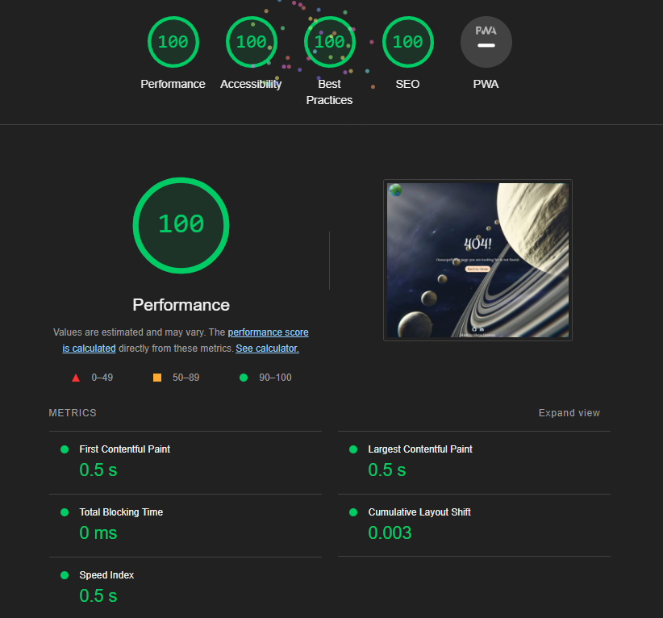

# Solar system Quiz Game Testing

## Table of content
* [**Manual Testing**](#manual-testing)
* [**Browser Compatibility**](#browser-compatibility)
* [**Responsiveness**](#responsiveness)
* [**Performance**](#performance)
* [**Code Validation**](#code-validation)
* [**Bugs**](#bugs)
* [**Accessibility**](#accessibility)

## Browser Compatibility

| **Browser tested** | **Intended appearance** | **Intended responsiveness** | 
|--------------------|-------------------------|-----------------------------|
| Google Chrome      |Very Good|Very Good|
| Mozzila            |Very Good|Very Good|
| Firefox            |Very Good|Very Good|
| Microsoft edge     |Good|Good|
| Safari*            |Good|Good|

* There was issue regarding Mozzila browser. More details can be found [here](#resolved-bugs).
* There were no issues found regarding the appearance and responsiveness on the rest of the browsers.

[Back to top](#table-of-content)

## Responsiveness

| **Device Tested** | **Site responsive** | **Renders as expected** | 
|-------------------|---------------------|-------------------------|
| Samsung Galaxy S21 Ultra|Very Good|Yes|
| Iphone 5s/6s      |Very Good|Yes|
| Ipad              |Very Good|Yes|
| Samsung Galaxy Tab 3|Very Good|Yes|
| Desktop           |Very Good|Yes|
| Laptop            |Very Good|Yes|
| Google Dev Tools  |Very Good|Yes|

* There were no issues found regarding the responsiveness.

[Back to top](#table-of-content)

## Performance

index.html

, 

contact.html

, 

404.html

, 

* The site was tested through Google Chrome Dev Tools - Lighthouse to check each of the pages for performance, accessibility, best practices, and SEO.
* On mobile devices the site is loading a bit slower than on large screen devices. This is due to large layout shifts. Now no further action is taken, but improvements will be made in the future.

[Back to top](#table-of-content)

## Code Validation

### HTML Validation

Index.html

Contact.html

404.html

* The validation site [W3C HTML Validator](https://validator.w3.org/nu/) was used to validate the HTML. 
* Some errors were found and resolved. More details can be found [here](#resolved-bugs).

### CSS Validation

CSS Test

* The validation site [W3C CSS Validator](https://jigsaw.w3.org/css-validator/#validate_by_input) was used to validate the CSS.
* No errors were found. There were 7 warnings regarding vendor extensions and pointer-events. but doesn`t affect the website.

### JavaScript Validation

Game.js

Email.js

Server.js

Question-array.js

Logo-footer.js

* The validation site [JSHint](https://jshint.com/) was used to validate the JavaScript files.
* Some errors were found and resolved. More details can be found [here](#resolved-bugs).

### Link Checker

Link Test

* The validation site [W3C Link Checker](https://validator.w3.org/checklink) was used to check the website for broken links.
* Some errors were found and resolved. More details can be found [here](#resolved-bugs).

[Back to top](#table-of-content)

## Accessibility

### Color contrast

* The main colors, used for the website, have very good contrast. They were tested with [WebAIM contrast checker](https://webaim.org/resources/contrastchecker/).

, , 

### WAVE Web Accessibility Evaluation Tools

Home page

Contact page

404 page

* On all pages same alert came up - that there is more than 1 redundant link. This is, because some links are navigating users to the same page, but was made to be user friendly and intuitive as possible for the user. No further action was taken.

Back to [**README.md**](README.md#testing)