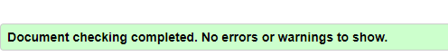

# Solar system Quiz Game Testing

#### **By Silviya Hristova**

[Click here to view the live web application](https://silviyahristova.github.io/solar-system-quiz/)

This is the documentation for The Solar System Quiz Game’s website. It has been built using HTML5, CSS3 and JavaScript for educational purposes as part of Code Institute’s Level 5 Diploma in Web Application Development.

---

## Table of content
* [**Manual Testing**](#manual-testing)
* [**Browser Compatibility**](#browser-compatibility)
* [**Responsiveness**](#responsiveness)
* [**Performance**](#performance)
* [**Code Validation**](#code-validation)
* [**Bugs**](#bugs)
* [**Accessibility**](#accessibility)

## Manual Testing

### User stories

 As a first-time visitor, I want to easily understand the main purpose of the site.

| **Feature** | **Test case** | **Outcome** |
|-------------|---------------|-------------|
|Main Heading| Read the heading| User is able to understand the main purpose of the website.|

As a first-time visitor, I want to take part in a fun, online, educational game.

| **Feature** | **Test case** | **Outcome** |
|-------------|---------------|-------------|
| Quiz section| Answer the quiz questions| User is taking part in a fun, online educational game.|

 As a first-time visitor, I want to easily access the game.

| **Feature** | **Test case** | **Outcome** |
|-------------|---------------|-------------|
| Quiz section| Fill the name, press "start quiz" button, read the rules, press "continue", start the game| User is able to access the game.|

As a first-time visitor, I want to find out how to play the game.

| **Feature** | **Test case** | **Outcome** |
|-------------|---------------|-------------|
| Rules section| Fill the name, press "start quiz" button, read the rules,.| User is able to find out how to play the game.|

As a first-time visitor, I want to know how many questions left to answer.

| **Feature** | **Test case** | **Outcome** |
|-------------|---------------|-------------|
|Quiz section| Question counter| User knows how many questions left to answer.|

As a first-time visitor, I want to know the scores, during the game.

| **Feature** | **Test case** | **Outcome** |
|-------------|---------------|-------------|
|Quiz section|Score counter |User knows the scores, during the game.|

As a first-time visitor, I want to be able to restart the quiz anytime.

| **Feature** | **Test case** | **Outcome** |
|-------------|---------------|-------------|
|Quiz section|Click "Restart" button.| User is able to restart the quiz anytime.|

As a first-time visitor, I want to see the result at the end of the quiz.

| **Feature** | **Test case** | **Outcome** |
|-------------|---------------|-------------|
|Result section|Click "Next" button after answering the last question, open result section.| User is able to see the result at the end of the quiz.|

As a first-time visitor, I want to be able to give my feedback.

| **Feature** | **Test case** | **Outcome** |
|-------------|---------------|-------------|
|Contact page|Click "Contact us" button on home section,open contact page,fill the form in contact page.| User is able to give feedback.|

As a first-time visitor, I want to navigate the site easily.

| **Feature** | **Test case** | **Outcome** |
|-------------|---------------|-------------|
|Buttons|Click any button.|User is able to navigate in the site.|
|Logo|Click Logo.| User can return to main page at all the time.|

As a first-time visitor, I want to be able to see and click on the links to their social media pages.

| **Feature** | **Test case** | **Outcome** |
|-------------|---------------|-------------|
|Footer| Scroll down to the bottom on any page;click social media icon.| User is brought to social media links.|

As a first-time visitor, I want to access the quiz on any device.

| **Feature** | **Test case** | **Outcome** |
|-------------|---------------|-------------|
|Website| Website is tested on different devices and browsers.|User can explore the website on any device and browser.|

Please refer to [**Responsiveness**](#responsiveness) and [**Browser compatibility**](#browser-compatibility) for more information.

### Website 

Buttons and links

| **Feature** | **Test case** | **Outcome** |
|-------------|---------------|-------------|
|Logo|Click logo|User is brought to the home page.|
|Start Quiz|Click button,If name field is empty|User is notified to enter the name.|
|Start Quiz|Click button. if name has less than 3 characters|User is notified to enter the name with more than 3 characters.|
|Start Quiz|Click button,If name field is filled correctly|User is brought to rules section.|
|Contact us|Click button|User is brought to the contact page.|
|Exit Quiz|Click button|User is brought to the home page.|
|Continue|Click button|User is brought to the quiz section.|
|Option buttons|Click button|User is answering the question.|
|Sound|Click button|User can mute or unmute the sound.|
|Restart|Click button|User is brought to the home page.|
|Next|Click button|User is able to see next question.|
|Next|Click button after answering the last question|User is brought to result section.|
|Start Again|Click button|User is brought to quiz area.|
|Contact form|Submit an empty form|Error signalling required fields|
|Contact form|Submit filled form|User send a message and received an email.|
|Send|Click button|User is required to fill the fields.|
|Send|Click button after filling the fileds|User is notified that his message has been sent successfully.|
|Back to Home|Click button|User is brought to the home page|

JavaScript Functionality

| **Feature** | **Test case** | **Outcome** |
|-------------|---------------|-------------|
|Start Quiz|Click button,If name field is empty|Alert message to enter the name.|
|Start Quiz|Click button. if name has less than 3 characters|Alert message to enter the name with more than 3 characters.|
|Start Quiz|Click button,If name field is filled correctly|Display rules section and hide home section.|
|Exit Quiz|Click button|Display home page and hide rules section.|
|Continue|Click button|Display quiz section and hide rules section,shuffle question and answers to the question, and start timer.|
|Score counter|Every correct answer adding +1 to the score, up to 10.|Score counter is increasing.|
|Score counter|Every incorrect answer doen not affect the score.|Score remain the same.|
|Question counter|When qustion is answered and next button is clicked, question counter adding +1 to the count, up to 10.|Question counter is increasing.|
|Sound toggle|Click button to change Off/On|Mute and unmute the sound during the game.|
|Timer|When reach 15 sec|Warning sound is playing is sound is ON.|
|Timer|When reach 0 sec|Alert message that is moving to the next question.|
|Timer|When reach 0 sec on last question|Alert message, display result section, hide quiz section.|
|Answer|Click button|Timer stops,check if answer is correct or incorect and highlighting the answers.|
|Restart|Click button|Display home page and hide quiz section.|
|Next|Cannot click button|If question is not answered,cannot change to next question.|
|Next|Click button after answering the question|Change to next question, restart the timer, add +1 to question counter, add +1 to score if correct answer is clicked.|
|Next|Click button after answering the last question|Display result section and hide quiz section.|
|Result|Result in percentage|The result is calculating in percentage depending on the total scores.Showing different messages,depending on the percentage result.|
|Start again|Click button|Display Quiz section, hide result section, restart timer, mute video, shuffle question and answers again, restart score and question counters.|
|Send|Click button|User is required to fill the fields.|
|Send|Click button after filling the fileds|Alert message that the message has been sent successfully, user receive email.|

### Users

* The website was tested by my family and friends. After asking a couple of questions about the website, I received feedback from them.
* There was feedback regarding the highlighting of correct and incorrect answers. After considering the input, the feature was adjusted to its current implementation.
* The feedback indicates that users are interested in competitive elements and rewards. They believe features like leaderboards and badges would make the game more exciting and rewarding, while more levels could ensure the game stays fresh and challenging.
* The feedback has been noted and appreciated. There will be no updates or changes to the quiz game at this time.

## Browser Compatibility

| **Browser tested** | **Intended appearance** | **Intended responsiveness** | 
|--------------------|-------------------------|-----------------------------|
| Google Chrome      |Very Good|Very Good|
| Mozzila            |Good|Very Good|
| Firefox            |Very Good|Very Good|
| Microsoft edge     |Good|Good|
| Safari*            |Good|Good|

* There was issue regarding Mozzila browser. More details can be found [here](#resolved-bugs).
* There were no issues found regarding the appearance and responsiveness on the rest of the browsers.

[Back to top](#table-of-content)

## Responsiveness

| **Device Tested** | **Site responsive** | **Renders as expected** | 
|-------------------|---------------------|-------------------------|
| Samsung Galaxy S21 Ultra|Very Good|Yes|
| Iphone 5s/6s      |Very Good|Yes|
| Ipad              |Very Good|Yes|
| Samsung Galaxy Tab 3|Very Good|Yes|
| Desktop           |Very Good|Yes|
| Laptop            |Very Good|Yes|
| Google Dev Tools  |Very Good|Yes|

* There were no issues found regarding the responsiveness.

[Back to top](#table-of-content)

## Performance

index.html

, 

contact.html

, 

404.html

, 

* The site was tested through Google Chrome Dev Tools - Lighthouse to check each of the pages for performance, accessibility, best practices, and SEO.
* On mobile devices the site is loading a bit slower than on large screen devices. This is due to large layout shifts. Now no further action is taken, but improvements will be made in the future.

[Back to top](#table-of-content)

## Code Validation

### HTML Validation

Index.html

Contact.html

404.html

* The validation site [W3C HTML Validator](https://validator.w3.org/nu/) was used to validate the HTML. 
* Some errors were found and resolved. More details can be found [here](#resolved-bugs).

### CSS Validation

CSS Test

* The validation site [W3C CSS Validator](https://jigsaw.w3.org/css-validator/#validate_by_input) was used to validate the CSS.
* No errors were found. There were 7 warnings regarding vendor extensions and pointer-events. but doesn`t affect the website.

### JavaScript Validation

Game.js

Email.js

Server.js

Question-array.js

Logo-footer.js

* The validation site [JSHint](https://jshint.com/) was used to validate the JavaScript files.
* Some errors were found and resolved. More details can be found [here](#resolved-bugs).

### Link Checker

Link Test

* The validation site [W3C Link Checker](https://validator.w3.org/checklink) was used to check the website for broken links.
* Some errors were found and resolved. More details can be found [here](#resolved-bugs).

[Back to top](#table-of-content)

## Bugs

### Resolved bugs

HTML validation errors

#### Home page

* Error

* Solution 

The solution was to change "section" to "div".

JavaScript validation errors

#### Game.js

* Error

* Solution 

The solution was to remove all unused variables. The undefine variable myQuestions is different js file linked to the index.html file.

#### Email.js

* Errors

* Solution 

The publicKey variable is used in script link in the head of the contact page as requirement. Same as emailJS undefine variable. The warning does not affect the functionality.

#### Server.js

* Errors

* Solution 

The solution was to add semicolons where they were mising.

Link errors

* Errors

* Solution 

The solution was to remove the script link for the YouTube API from the index.html file. It was originally included when the YouTube API was added to the project, but it is no longer needed.

### Unresolved bugs

* The sound button is not visible in Mozzila browser. No problem found on the rest of the browsers.

## Accessibility

### Color contrast

* The main colors, used for the website, have very good contrast. They were tested with [WebAIM contrast checker](https://webaim.org/resources/contrastchecker/).

, , 

### WAVE Web Accessibility Evaluation Tools

Home page

Contact page

404 page

* On all pages same alert came up - that there is more than 1 redundant link. This is, because some links are navigating users to the same page, but was made to be user friendly and intuitive as possible for the user. No further action was taken.

Back to [**README.md**](README.md#testing)